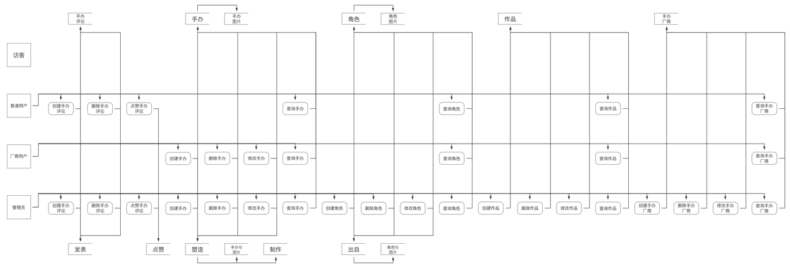
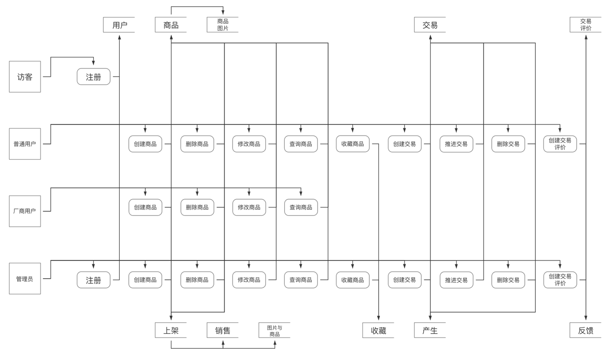
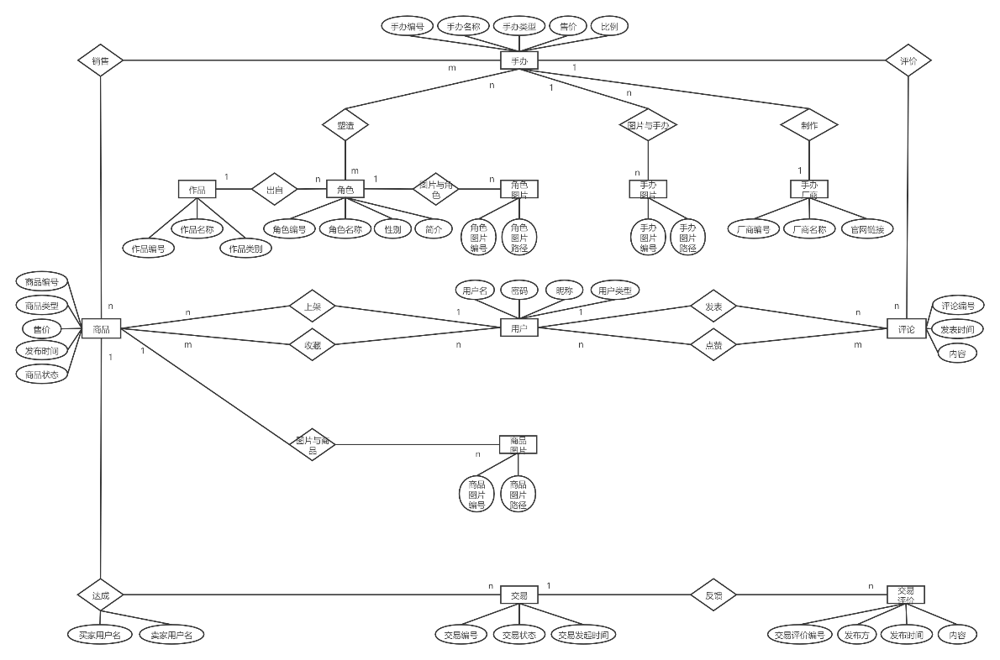

# FigureHub

集搜索、交易、分享于一体的模玩社区。

## 技术栈

本项目采用前后端分离开发：

- 前端基于 **Vue 2 + Ant Design**。
- 后端基于 **Rails 5 (only api mode) + Rspec**。

## 项目文档

- 功能演示：[FigureHub Quick Start](https://zhuanlan.zhihu.com/p/336716239)
- 接口文档见 Rails 路由下 `/api/docs`

## 快速开始

```bash
### Frontend
cd figurehub_frontend
# before install
npm config set registry https://registry.npm.taobao.org
npm set sass_binary_site http://cdn.npm.taobao.org/dist/node-sass
# install and run
npm install
npm run serve

### Backend
cd ../figurehub_backend
bundle install
rails db:migrate
rails db:seed
rails server -d -b 0.0.0.0 -p 5000
```

## 数据库介绍

本系统数据库包含十余个实体：用户、作品、角色、厂商、手办、商品、交易、评价、评论等。

系统支持如下功能：

- 用户共分为三种：普通用户、厂商用户、管理员。
  - 采用 JWT 鉴权，订单与发布页面需登录才可访问。
  - 在登录界面提供了测试用的管理员、普通用户账号，可直接登录。
  - 管理员可以管理平台所有商品，进行下架处理。
  - 管理员和厂商用户可以编辑百科信息，添加作品、角色、手办等。
- 用户可以在平台交易手办，发布一手或二手物品。
  - 发布时可选择商品数量，库存为 0 后将无法购买，但仍会展示。
- 用户可以根据关键词搜索百科，获取手办的相关信息以及属性。
  - 商品详情页的标签同样可以跳转到对应的百科页面。
- 用户可以购买其他用户发布的商品（未对接支付接口），并在完成交易后对交易进行评价。
- 用户可以发表对手办的评论，与其他用户进行分享与交流。
  - 对某一商品评论时，评论对象为该商品对应的手办。
  - 在用户的个人主页，可以看到该用户过往发言。

根据数据库功能将数据流图分为两部分，数据流图百科部分：



数据流图交易部分：



系统基本 E-R 图（点赞与收藏功能未实现）：



## 其他说明

- 该项目的前端基于 2020 年秋季数据库课程项目，彼时我在团队中负责前端部分，并参与了数据库设计过程。后端由其他同学使用 MySpring 实现。
- 这次主要是用 Ruby on Rails 重写了后端，将接口改为 RESTful 风格，同时完善了前端当时来不及实现的功能（如商品详情到百科的关联等）。
